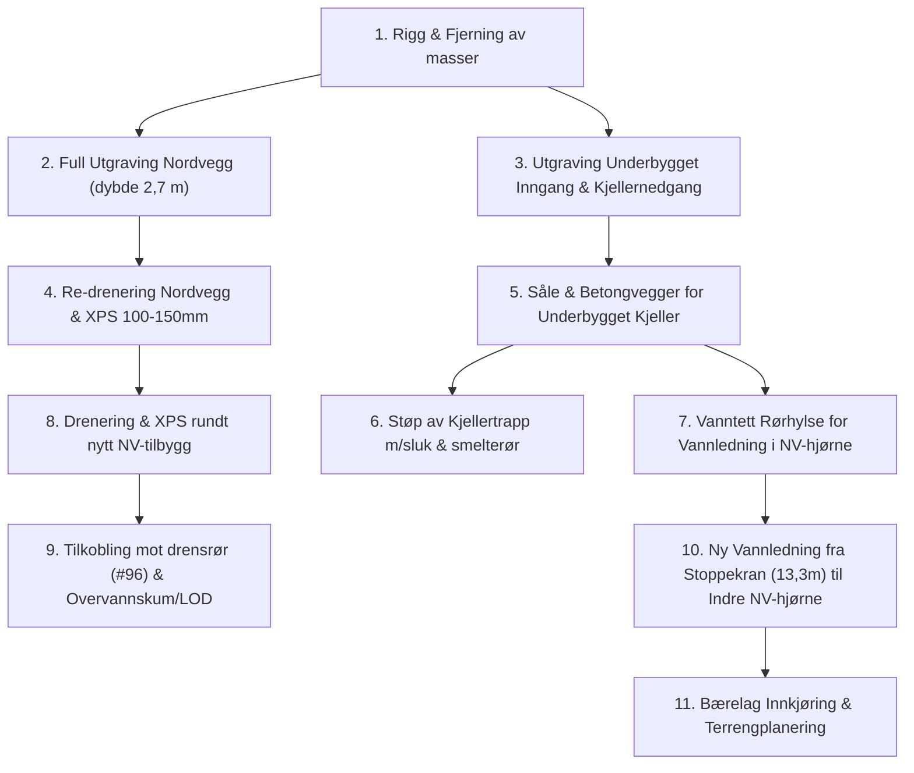

# 🚜 Anbudsforespørsel & Planskisse: Grunnarbeider Nord & Nytt Inngangsparti

**Prosjekt:** M6 Totalrehabilitering – Myrteveien 6, 3152 Tolvsrød  
**Gnr/Bnr:** 140 / 371, Tønsberg kommune  
**Tiltakshaver:** Magnus Kirø  
**Dato:** 24. september 2026 (Revidert: Inkl. underbygget inngangsparti & NV-vanninntak)  
**Prosjektkode GitHub:** `magnuskiro/m6#92` (Del A: Grunnarbeider Nord)  

---

## 1. Innledning & Bakgrunn

Eiendommen Myrteveien 6 gjennomgår en helhetlig totalrehabilitering. På nordsiden og i overgangen mot nord-vest skal det gjennomføres en samlet grunnarbeids- og betongpakke bestående av:
1. **Re-drenering og fuktsikring av nordveggen:** Dagens drensrør ligger for høyt (topp på 236 cm under topp grunnmur). Nytt drensrør skal legges med bunn på ca. **265–275 cm** dybde (kote ~C+24,1) for å senke grunnvannet (målt på 253–255 cm) og sikre tørr kjellersåle.
2. **Ny inngangsplatting og overbygg på nordveggen (inntegnet omriss):** På nordveggen etableres ny utvendig inngangsplatting for 1. etasje. Denne plattingen danner overbygg/tak for den nye kjellernedgangen. Under dette taket (på kjellernivå kote C+24,4) etableres:
   - Ny kjellerdør inn i kjellermuren
   - Utebod
   - Utvendig skap for strøminntak
   - Støpt repos foran kjellerdør med trappesluk
3. **Kjellertrapp (iht. A-100PS & A-201PS):** Plasstøpt betongtrapp og vanger ned langs nordveggen til kote **C+24,4** (repos under inngangsplattingen), inkludert trappesluk og vannbårne snøsmelterør (PEX) i trinnene.
4. **Vannledning og teknisk inntak i indre nordvest-hjørne:** Eksisterende stikkledning fra Trollheggveien går inn langs 13,3 m-målelinjen med stoppekran ved tallet 13,3. Ny **32 mm PE-vannledning** kobles på denne stoppekranen og føres nordover til det **indre nordvest-hjørnet** (der hovedhusets vestvegg møter nordveggen på tverrfløyen), og tas inn i den nye underbygde kjelleren via vanntett Doyma-hylsegjennomføring.
5. **Oppgradering og justering av innkjøring fra Myrteveien:** Innkjøringen flyttes/vinkles litt østover for direkte adkomst, og det etableres forsterket bærelag for tung anleggstrafikk (betong- og kranbiler).

Det bes om fastpris / regulerbare enhetspriser per post basert på dette underlaget.

---

## 2. Tegningsgrunnlag & Måledata

Forespørselen bygger på følgende tegningsunderlag (utarbeidet av KB Arkitekter AS):
* **A-001 Situasjonsplan (PS):** Plassering av bolig, eksisterende/ny avkjørsel, terrenglinjer.
* **A-100PS U. Etg plan:** Planløsning kjeller, plassering av kjellernedgang og tilstøtende kjellerrom.
* **A-101PS 1. Etg plan:** Nytt inngangsparti (1.07 Gang/garderobe ca. 14,7 m² brutto, fotavtrykk utstikk ca. 2,5 m × 3,5 m).
* **A-201PS Snitt B – Bolig:** Snitt gjennom terreng, ny kjellernedgang og etasjehøyder.
* **A-300PS & A-301PS Fasader:** Fasadetegninger nordvest og nordøst med eksisterende og planlagt terreng.

### 🗺️ Planskisse over Anleggsområdet & Tiltakene

### Kritiske kontrollmål (Referanse: Topp eksisterende grunnmur = 0,00 m)
* **Terreng ved nordvegg i dag:** ca. -0,50 m til -0,90 m
* **Dagens drensrør (topp):** -2,36 m *(for høyt)*
* **Målt vannspeil i kum og kjellergrøft:** -2,53 m til -2,55 m
* **Nytt gjennomføringsrør fra eksisterende kjeller (topp):** -2,46 m *(stikker ut under eksisterende grunnmur)*
* **Underkant ny kjellersåle:** -2,42 m til -2,45 m
* **Prosjektert kjellerdør / platå i kjellernedgang:** Kote **C+24,4** (ca. -2,40 m under topp grunnmur)
* **Underkant ny såle for underbygget inngangsparti:** ca. **-2,50 m til -2,55 m**
* **Ny bunn drensgrøft rundt hele nord- og nordvesthjørnet:** ca. **-2,65 m til -2,75 m** (Kote ~C+24,1)

---

## 3. Omfang & Arbeidsbeskrivelse

### Post 1: Rigg, Drift, Kabelsikring & Massetransport
* Rigging av maskinpark (anbefalt 8–15 tonns beltegraver med tiltrotator og klype).
* **Påvisning og sikring av eksisterende kabler/rør:**
  * Fiberkabler (Altibox og Telenor).
  * Hovedstrømkabel (400V 3-fase) og kabel til eksisterende garasje.
  * 2 par kollektorslanger til energibrønner (jordvarme).
* Laste, transportere og deponere overskuddsleire og uegnede masser. Egnede steinmasser settes til side for gjenbruk.

---

### Post 2: Utgraving for Drensgrøft (fra SV-hjørne Tverrfløy), Platting/Overbygg & Kjellernedgang
* **Drensgrøft langs tverrfløy og nordvegg:**
  * Utgraving fra **syd-vest hjørnet av tverrfløyen mot vest**, langs tverrfløyens vest- og nordvegg, og videre langs hele nordveggen på hovedhuset (totalt ca. 22–24 lm grøft langs bygningskroppen).
  * Gravedybde ned til bunn drensgrøft på ca. 2,65–2,75 m (kote ~C+24,1) for å sikre fall og avrenning under nytt kjellergulvnivå.
* **Område for ny inngangsplatting / overbygg på nordveggen:**
  * Utgraving ned til kote C+24,4 (samt 20 cm for pukkpute / isolasjon) for arealet under plattingen der ny kjellerdør, utebod og el-skap etableres.
  * Sikring mot setninger i tilstøtende eksisterende murverk under graving.
* **Kjellertrapp:** Utgraving for trappeløp langs nordveggen ned til repos foran kjellerdør (kote C+24,4).

---

### Post 3: Fundamentering & Betongarbeid (Støpt Trapp, Repos & Understøttelse)
* **Pukksåle:** Etablering av komprimert pukksåle (15–20 cm pukk 11–16 mm svøpt i fiberduk N2) under nye fundamenter, trapp og repos.
* **Betongsåle & støttemurer:**
  * Støping av armert betongsåle og støttemurer/vanger for kjellertrappen langs nordveggen.
  * Støping av støttemur/ringmur og bærekonstruksjon for inngangsplattingen over.
* **Kjellerinngang, Utebod & El-skap (under taket):**
  * Støping av frostsikret, armert betongplate/repos på kote C+24,4 med integrert fall mot trappesluk.
  * Tilrettelegging for montering av ny utvendig kjellerdør i eksisterende kjellermur.
  * Romavdeling/innstøping for utvendig skap for strøminntak samt utebod under overbygget.
* **Kjellertrapp:**
  * Forskaling og støping av trappeløp og vangemur i betong B35 M40.
  * Montering av trappesluk / drensrenne i reposet foran kjellerdør med 110 mm tilkobling til drensledning.
  * Innstøping av 20 mm PEX-smelterør (tur/retur for vannbåren snøsmelting) i trinn og repos, med rørgjennomføring inn i kjeller.
* **Dekke/platting for inngangsparti (1. etg):**
  * Etablering av bærende konstruksjon/dekke for inngangsplattingen (iht. fasade- og plantegning) som danner det tette taket over kjellernedgangen, uteboden og el-skapet.

---

### Post 4: Drenering, Fuktsikring & Isolering (Tverrfløy, Nordvegg & Nytt Inngangsparti)
* Rengjøring og forberedelse av eksisterende og nye murflater fra SV-hjørnet av tverrfløy og langs hele nordfasaden.
* Montering av **Platon knotteplast** med godkjente klemlister langs tverrfløyens vest-/nordmur, hovedhusets nordmur og rundt nye underbygde kjellervegger.
* Montering av **100–150 mm XPS-isolasjon** (f.eks. XPS 300) utenpå knotteplasten for fullverdig utvendig isolering.
* Legging av **110 mm perforert drensrør** på 10 cm avrettet pukkpute (11–16 mm) fra SV-hjørnet av tverrfløyen, forbi det nye inngangspartiet og kjellertrappen, og frem til overvannskum (totalt ca. 35 lm).
* Innpakking av drensrør og pukkpute i **fiberduk klasse N2** (geotekstil).
* **Påkobling av eksisterende kjellergjennomføring:** Skjøte og tilkoble det nye røret fra kjelleren (#96, topp 246 cm) inn på drensnettet. Røret kommer fra innvendig grøft (ca. 1,5 m fra nordvegg inne), er ført under grunnmur og under den nye kjellertrappen, og kobles til drensledningen like på utsiden av trappevangen.
* **Overvannskum / Resipient:** Kontroll og tilkobling mot overvannskum/LOD. Det sikres kontinuerlig fall fra bunn drensrør (kote ~C+24,1) mot stenkiste på egen tomt.

---

### Post 5: Ny Vannledning fra Stoppekran (Trollheggveien) til Indre NV-hjørne
* Påkobling på eksisterende stikkledning/stoppekran ved 13,3 m-målelinjen (fra Trollheggveien, jf. situasjonsplan A-001).
* Graving av VA-grøft fra stoppekranen og nordover til det indre nordvest-hjørnet der vestveggen møter nordveggen på tverrfløyen (ca. 14–16 lm).
* Levering og legging av **32 mm PE100 SDR11 vannledning** i varerør med fiberduk, sandpute og markeringsbånd m/søketråd.
* Innføring gjennom **vanntett Doyma-hylse** i ny underbygget kjellervegg i indre nordvest-hjørne, klargjort med innvendig hovedstoppekran for videre distribusjon.
* Frostsikring: Legges i frostsikker dybde (min. 1,6 m) eller isoleres med 50 mm XPS og selvregulerende varmekabel dersom grunnforhold/fjell krever grunnere forlegning.

---

### Post 6: Infrastruktur, Bærelag & Terrengplanering
* **Trekkerør (røde korrugerte kabelrør):**
  * 1 stk. Ø110 mm rør til fremtidig dobbelgarasje (strøm, elbillader, styring).
  * 1 stk. Ø50 mm rør for snøsmelting / styring i innkjøring.
  * Trekkerør for fiber og reserve.
* **Forsterket bærelag og utvidelse av innkjøring:**
  * Innkjøringens vestgrense følger målelinjen på 27,7 m helt ut til Myrteveien.
  * Ved husfasaden dekker innkjøringen husets fulle bredde (inkl. trapp og inngangsparti, ca. 9,5 m bredde).
  * Mot Myrteveien vider innkjøringen seg ut østover til eksisterende lyktestolpe ca. midt på tomtegrensen mot nord (jf. planskisse).
  * Samlet areal for opparbeidelse er ca. 200 m². Dette gir optimal svingeradius og bæreevne for betongbiler, mobilkran og fremtidig parkering.
  * Utlegging av fiberduk klasse N3 i bunn.
  * Oppfylling og komprimering med 30–40 cm samfengt pukk (0–63 mm / 20–120 mm) dimensjonert for tungtrafikk.
* **Tilbakefylling og planering:**
  * Tilbakefylling mot kjellermurer med drenerende pukk (11–32 mm) inntil 50 cm under terreng.
  * Terrengforming og arrondering mot nordvest jf. situasjonsplan A-001.

---

## 4. Prisskjema / Tilbudssammendrag

Alle priser oppgis ekskl. mva.

| Post | Beskrivelse | Enhet | Mengde | Enh.pris (NOK) | Sum (NOK) |
| :--- | :--- | :---: | :---: | :---: | :---: |
| **1.0** | **Rigg, drift, kabelsikring og oppmåling** | RS | 1 | | |
| **2.1** | Utgraving drensgrøft fra SV-hjørne tverrfløy og langs nordvegg (dybde inntil 2,75 m) | m³ | ca. 65 | | |
| **2.2** | Utgraving for inngangsplatting, repos (kote C+24,4) & trapp | m³ | ca. 45 | | |
| **2.3** | Laste og transportere overskuddsmasser til deponi | m³ / tonn | Anslått | | |
| **3.1** | Pukksåle og komprimering under nye fundamenter/trapp | m² | ca. 20 | | |
| **3.2** | Forskaling og støping av såle og støttemurer for trapp og platting | lm | ca. 12 | | |
| **3.3** | Støpt plate/repos for kjellerdør, utebod og el-skap (kote C+24,4) | m² | ca. 12 | | |
| **3.4** | Forskaling, armering og støping av kjellertrapp & vanger langs nordmur | RS | 1 | | |
| **3.5** | Etablering av bærekonstruksjon/dekke for inngangsplatting 1. etg | m² | ca. 9 | | |
| **3.6** | Montering av trappesluk og 20mm PEX-smelterør | RS | 1 | | |
| **4.1** | Rengjøring mur, montering av knotteplast & klemlister (tverrfløy + nordvegg) | m² | ca. 65 | | |
| **4.2** | Montering av 100–150 mm XPS isolasjon (tverrfløy + nordvegg) | m² | ca. 65 | | |
| **4.3** | 110 mm perforert drensrør m/pukk & fiberduk N2 (fra SV-hjørne til kum) | lm | ca. 35 | | |
| **4.4** | Påkobling av rør fra kjeller (#96) og tilkobling mot kum/LOD | RS | 1 | | |
| **5.1** | Grøft og legging av ny 32mm vannledning fra stoppekran (13,3m) til indre NV-hjørne | lm | ca. 15 | | |
| **6.1** | Levering og trekking av DV-rør (110mm / 50mm) | lm | ca. 40 | | |
| **6.2** | Bærelag innkjøring (fiberduk N3 + 0–63 mm pukk, vestgrense langs 27,7m, utvidet til lyktestolpe) | m² | ca. 200 | | |
| **6.3** | Tilbakefylling m/drensmasser og planering nord-vest | timer/m³ | Anslått | | |
| **SUM** | **TOTAL FASTPRIS EKSKL. MVA** | | | | **NOK ________** |

### Regulerbare timepriser ved eventuelle tilleggsarbeider:
* Gravemaskin (8–15 tonn) inkl. fører: **______ NOK/time**
* Lastebil (3- eller 4-akslet tippbil): **______ NOK/time**
* Fagarbeider grunnarbeid / betong: **______ NOK/time**

---

## 5. Fremdriftsplan & Forutsetninger

1. **Oppstart:** Snarest mulig i Q4 2026 (koordinert med innvendig støpearbeid i kjeller).
2. **Gjennomføringstid:** Estimert til ca. 2–3 uker samlet anleggstid.
3. **HMS & Ansvar:** Entreprenør har totalansvar for forskriftsmessig grøftesikring og sikring av eksisterende bygningskropp under utgraving.
4. **Befaring:** Befaring på eiendommen avtales fortløpende med tiltakshaver.

---
*Vedlegg: Tegningssett KB Arkitekter AS (A-001, A-100PS, A-101PS, A-201PS, A-300PS, A-301PS).*
