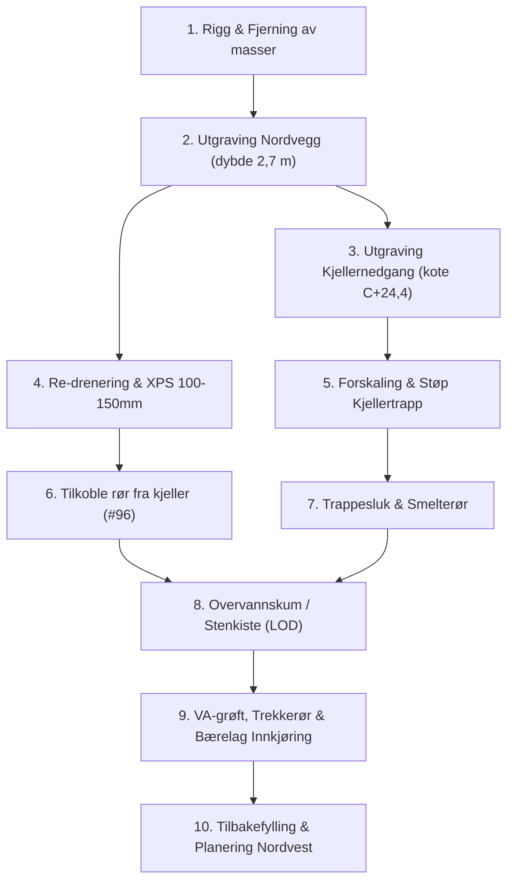

# 🚜 Anbudsforespørsel & Planskisse: Grunnarbeider Nord

**Prosjekt:** M6 Totalrehabilitering – Myrteveien 6, 3152 Tolvsrød  
**Gnr/Bnr:** 140 / 371, Tønsberg kommune  
**Tiltakshaver:** Magnus Kirø  
**Dato:** 24. september 2026  
**Prosjektkode GitHub:** `magnuskiro/m6#92` (Del A: Grunnarbeider Nord)  

---

## 1. Innledning & Bakgrunn

Eiendommen Myrteveien 6 gjennomgår en helhetlig totalrehabilitering. På nordfasaden skal det gjennomføres en samlet grunnarbeidspakke bestående av:
1. **Re-drenering og fuktsikring av nordveggen:** Eksisterende drensrør ligger for høyt (topp på 236 cm under topp grunnmur). Nytt drensrør skal legges med bunn på ca. **260–270 cm** dybde for å sikre tørr kjellersåle og tømme grunnvann som i dag står på kote ~253–255 cm.
2. **Etablering av ny utvendig kjellernedgang:** Plasstøpt betongtrapp og vanger ned til kote **C+24,4** (kjellerdør) iht. godkjente arkitekttegninger, inkludert trappesluk og vannbårne snøsmelterør i trinnene.
3. **Oppgradering og justering av innkjøring fra Myrteveien:** Innkjøringen flyttes/vinkles litt østover for bedre adkomst, og det etableres forsterket bærelag for tung anleggstrafikk.
4. **Teknisk grøftetrasé:** Ny kommunal vannledning inn til boligen, trekkerør for fremtidig dobbelgarasje, og innfelling av vannbårne smelterør.

Det bes om fastpris / regulerbare enhetspriser per post basert på dette grunnlaget.

---

## 2. Tegningsgrunnlag & Måledata

Forespørselen bygger på følgende tegningsunderlag (utarbeidet av KB Arkitekter AS):
* **A-001 Situasjonsplan (PS):** Plassering av bolig, eksisterende/ny avkjørsel, terrenglinjer.
* **A-100PS U. Etg plan:** Planløsning kjeller, plassering av ny utvendig kjellernedgang.
* **A-201PS Snitt B – Bolig:** Snitt gjennom terreng, ny utvendig kjellernedgang og etasjehøyder.
* **A-300PS & A-301PS Fasader:** Fasadetegninger nordvest og nordøst med eksisterende og planlagt terreng.

### Kritiske kontrollmål (Referanse: Topp eksisterende grunnmur = 0,00 m)
* **Terreng ved nordvegg i dag:** ca. -0,50 m til -0,90 m
* **Dagens drensrør (topp):** -2,36 m *(for høyt)*
* **Målt vannspeil i terreng / utvendig kum:** -2,53 m
* **Målt vannspeil i kjellergrøft:** -2,55 m
* **Nytt gjennomføringsrør fra kjeller (topp):** -2,46 m *(stikker ut under grunnmur)*
* **Underkant ny innvendig betongsåle:** -2,42 m til -2,45 m
* **Prosjektert kjellerdør / platå i kjellernedgang:** Kote **C+24,4** (ca. -2,40 m under topp grunnmur)
* **Ny bunn drensgrøft nordvegg:** ca. **-2,65 m til -2,75 m** (Kote ~C+24,1)

---

## 3. Omfang & Arbeidsbeskrivelse

### Post 1: Rigg, Drift & Sikring
* Rigging av nødvendig maskinpark (anbefalt 8–15 tonns beltegraver med pusseskuffe og klype).
* Sikring av eksisterende kabler og rør under graving:
  * Fiberkabler (Altibox og Telenor).
  * Hovedstrømkabel (400V 3-fase) og eksisterende kabel til garasje.
  * 2 par kollektorslanger til energibrønner (jordvarme).
* Midlertidig avstiving / skråning av grøftekant mot ras i løsmasser.

---

### Post 2: Utgraving & Massehåndtering
* **Nordvegg:** Utgraving langs ca. 10–12 løpemeter grunnmur ned til fast grunn / kote ~C+24,1 (dybde 2,65–2,75 m fra topp grunnmur).
* **Kjellernedgang:** Utgraving av sjakt for kjellertrapp og repos ned til kote C+24,4 + 20 cm for drenerende pukkpute.
* **Innkjøring:** Avgraving av matjord/topplag og etablering av ny innkjøringstrasé mot øst.
* **Massebalanse:** Egnede drenerende steinmasser legges til side for gjenbruk. Overskuddsleire og uegnede masser kjøres til godkjent deponi. Noe masser benyttes til planering mot nord-vest jf. situasjonsplan.

---

### Post 3: Re-drenering & Fuktsikring Nordvegg
* Rengjøring og høytrykksspyling av eksisterende betongmur.
* Montering av **Platon grunnmursplast** (knotteplast) med godkjent klemlist og topplist i overkant terreng.
* Montering av **100–150 mm XPS-isolasjon** (f.eks. XPS 300) utenpå knotteplasten for fullverdig utvendig isolering (SINTEF-anbefaling: min. 50 % av isolasjonen på utsiden av kjellermur).
* Legging av **110 mm perforert drensrør** med slisser opp/sideveis på 10 cm avrettet pukkpute (11–16 mm).
* Innpakking av hele drensrøret og pukkputen i **fiberduk klasse N2** (geotekstil).
* **Påkobling av kjellerens drensrør:** Det nye gjennomføringsrøret (topp 246 cm) som stikker ut under grunnmuren skal skjøtes tett med bend og kobles sikkert inn på det nye drensnettet.
* **Overvannskum / Resipient:** Kontroll og tilkobling mot drens-/overvannskum. Det må sikres at utløp fra kum har kontinuerlig fall mot stenkiste/LOD-infiltrasjon på egen tomt under kote C+24,1.

---

### Post 4: Ny Utvendig Kjellernedgang (Støp & VA)
* Etablering av komprimert pukksåle (15–20 cm pukk 11–16 mm) under trappeløp og repos.
* **Forskaling og armering:** Forskaling av trappevanger/støttemurer og trinn jf. arkitektmål. Armering med kamstål Ø10/Ø12 og armeringsstoler.
* **Betongstøp:** Støping av trapp og vanger i vanntett betongkvalitet B35 M40 / B30 SV40.
* **Overvannshåndtering:** Montering av trappesluk / drensrenne i bunnen av trappen foran kjellerdør. Sluk kobles med 110 mm rør direkte til drensledningen.
* **Snøsmelteanlegg:** Montering og klamring av 20 mm PEX-rør (tur/retur for vannbåren snøsmelting) i trinnene og reposet, med føring inn gjennom yttervegg til fremtidig teknisk rom før støping.

---

### Post 5: Infrastruktur i Grøft, Innkjøring & Bærelag
* **Ny kommunal vannledning:** Graving av VA-grøft fra tilknytningspunkt i Myrteveien og inn til bolig (nordvesthjørne eller teknisk rom). Legging av 32 mm PE-vannledning i varerør med fiberduk og isolasjon/varmekabel der frostfri dybde (1,6 m) ikke oppnås.
* **Trekkerør (røde korrugerte kabelrør Ø110 mm / Ø50 mm):**
  * 1 stk. Ø110 mm rør til fremtidig dobbelgarasje (strøm, elbillader, styring).
  * 1 stk. Ø50 mm rør for snøsmelting / styring i innkjøring.
  * Trekkerør for fiber og reserve.
* **Forsterket bærelag i innkjøring:**
  * Utlegging av fiberduk klasse N3 i bunn av innkjøringstrasé.
  * Oppfylling og komprimering med 30–40 cm samfengt pukk (f.eks. 0–63 mm / 20–120 mm) for å tåle tung anleggstrafikk (betongbiler, mobilkran).
* **Tilbakefylling og planering nord-vest:**
  * Tilbakefylling mot drensvegg med drenerende masser (grov singel/pukk 11–32 mm) inntil 50 cm under terreng.
  * Planering og arrondering mot nabogrense og terreng nord-vest iht. situasjonsplan A-001.

---

## 4. Prisskjema / Tilbudssammendrag

Tilbyder bes fylle ut prisskjemaet nedenfor. Alle priser oppgis ekskl. mva.

| Post | Beskrivelse | Enhet | Mengde | Enh.pris (NOK) | Sum (NOK) |
| :--- | :--- | :---: | :---: | :---: | :---: |
| **1.0** | **Rigg, drift, oppmåling og kabelsikring** | RS | 1 | | |
| **2.1** | Utgraving for nordvegg (dybde inntil 2,7 m) | m³ | ca. 45 | | |
| **2.2** | Utgraving for kjellernedgang | m³ | ca. 20 | | |
| **2.3** | Laste og transportere overskuddsmasser til deponi | tonn / m³ | Anslått | | |
| **3.1** | Rengjøring mur, montering av knotteplast & kantlist | m² | ca. 25 | | |
| **3.2** | Montering av 100–150 mm XPS isolasjon | m² | ca. 25 | | |
| **3.3** | Levering og legging av 110 mm drensrør m/pukk & fiberduk N2 | lm | ca. 14 | | |
| **3.4** | Påkobling av drensrør fra kjeller og kobling mot kum/LOD | RS | 1 | | |
| **4.1** | Forskaling og armering av kjellertrapp og vanger | RS | 1 | | |
| **4.2** | Betong B35 M40 inkl. pumping og glatting | m³ | ca. 3–4 | | |
| **4.3** | Montering av trappesluk og innlegging av PEX-smelterør | RS | 1 | | |
| **5.1** | Grøft og legging av ny vannledning inn til bolig | lm | ca. 15 | | |
| **5.2** | Levering og trekking av DV-rør (110mm / 50mm) | lm | ca. 40 | | |
| **5.3** | Bærelag innkjøring (fiberduk N3 + 0–63 mm komprimert pukk) | m² | ca. 80 | | |
| **5.4** | Tilbakefylling m/drensmasser og planering nord-vest | timer/m³ | Anslått | | |
| **SUM** | **TOTAL FASTPRIS EKSKL. MVA** | | | | **NOK ________** |

### Regulerbare timepriser ved eventuelle tilleggsarbeider:
* Gravemaskin (8–15 tonn) inkl. fører: **______ NOK/time**
* Lastebil (3- eller 4-akslet tippbil): **______ NOK/time**
* Grunnarbeider / fagarbeider betong: **______ NOK/time**

---

## 5. Fremdriftsplan & Forutsetninger

1. **Oppstart:** Ønsket snarest mulig i Q4 2026 (koordinert med innvendig støping i kjeller).
2. **Gjennomføringstid:** Estimert til ca. 1,5–2 uker effektiv anleggstid.
3. **HMS & Ansvar:** Entreprenør er ansvarlig for forskriftsmessig sikring av åpen grøft og naboeiendom iht. gjeldende HMS-krav.
4. **Befaring:** Befaring på eiendommen (Myrteveien 6) kan avtales fortløpende.

---
*Vedlegg tilgjengelig på forespørsel: Tegningssett KB Arkitekter AS (A-001, A-100PS, A-201PS, A-300PS, A-301PS).*
