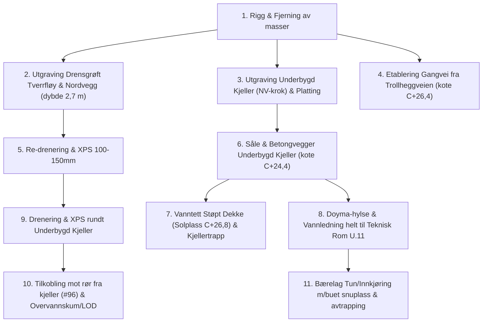

# 🚜 Anbudsforespørsel & Planskisse: Grunnarbeider Nord, Vest & Nytt Inngangsparti

**Prosjekt:** M6 Totalrehabilitering – Myrteveien 6, 3152 Tolvsrød  
**Gnr/Bnr:** 140 / 371, Tønsberg kommune  
**Tiltakshaver:** Magnus Kirø  
**Dato:** 24. september 2026 (Revidert iht. brukerskisse: Gangvei fra Trollheggveien, justert solplass, vann til teknisk rom & buet tun i syd-vest)  
**Prosjektkode GitHub:** `magnuskiro/m6#92` (Del A: Grunnarbeider Nord & Vest)  

---

## 1. Innledning & Bakgrunn

Eiendommen Myrteveien 6 gjennomgår en helhetlig totalrehabilitering. På nordsiden og i overgangen mot nord-vest skal det gjennomføres en samlet grunnarbeids- og betongpakke bestående av:
1. **Re-drenering og fuktsikring fra SV-hjørnet av tverrfløy til overvannskum:** Dagens drensrør ligger for høyt (topp på 236 cm under topp grunnmur). Nytt drensrør skal legges med bunn på ca. **265–275 cm** dybde (kote ~C+24,1) for å senke grunnvannet (målt på 253–255 cm) og sikre tørr kjellersåle rundt hele tverrfløyen og nordfasaden.
2. **Ny inngangsplatting og overbygg på nordveggen (inntegnet omriss, kote C+26,8):** På nordveggen etableres ny utvendig inngangsplatting for 1. etasje. Denne plattingen danner overbygg/tak for den nye kjellernedgangen. Under dette taket (på kjellernivå kote C+24,4) etableres:
   - Ny kjellerdør inn i kjellermuren
   - Utebod
   - Utvendig skap for strøminntak
   - Støpt repos foran kjellerdør med trappesluk
   - Utvendig avtrapping (trinn) ned fra inngangsplattingen (kote C+26,8) til det lavere nivået for innkjøringen (kote C+25,0)
3. **Kjellertrapp (iht. A-100PS, A-201PS & A-001):** Plasstøpt betongtrapp og vanger ned langs nordveggen til kote **C+24,4** (repos under inngangsplattingen), inkludert trappesluk og vannbårne snøsmelterør (PEX) i trinnene.
4. **Solplatting for kveldssola m/underbygd kjeller (NV-krok, 2,0 m × 2,5 m firkant):** I vinkelen mellom tverrfløyen og inngangsplattingen etableres en solplatting for kveldssola (ca. **2,0 m mot vest × 2,5 m mot nord = 5,0 m²** fotavtrykk) med fullt underbygd kjeller (markert med kryss `X` på planskisse).
   - Dette tiltaket erstatter og formaliserer dagens eksisterende inngangsparti (vedlikehold).
   - Kjeller underbygges ned til kote **C+24,4** med komprimert pukksåle, støpt bunnplate, armerte betongvegger mot terreng (ca. 4,5 lm) og et vanntett, støpt betongdekke (solplatting over på kote ~C+26,8).
   - Den nye drensledningen og knotteplast/XPS føres rundt ytterveggene på dette nye kjellerrommet.
5. **Ny gangvei / sti fra Trollheggveien til ny inngangsdør:**
   - Etablering av ny gangsti (ca. 25 lm) fra vestre tomtegrense mot Trollheggveien, over hagearealet og frem til den nye inngangsdøren i 1. etg.
   - Stien etableres i det øvre, naturlige terrengnivået på kote **~C+26,4**.
6. **Vannledning helt inn til teknisk rom i kjelleren (U.11):**
   - Eksisterende stikkledning fra Trollheggveien går inn langs 13,3 m-målelinjen med stoppekran ved tallet 13,3.
   - Ny **32 mm PE-vannledning** kobles på denne stoppekranen og føres nordover til det indre nordvest-hjørnet (NV-krok).
   - Ledningen tas inn i den nye underbygde kjelleren via vanntett **Doyma-hylsegjennomføring**.
   - **Innvendig føring:** Ledningen føres videre innvendig i kjelleren gjennom underbygd kjellerrom (U.02) og rett inn til **Teknisk rom (U.11)** i senter av huset (kote C+24,4).
7. **Innkjøring & riggområde fra Myrteveien (~200 m²):**
   - **Trasé:** Vestgrensen følger målelinjen på 27,7 m helt ut til Myrteveien. Utkjøringen ved Myrteveien ligger **vest for eksisterende lyktestolpe** (ca. midt på tomtegrensen mot nord). Ved fasaden dekker innkjøringen husets fulle bredde (~9,5 m inkl. kjellertrapp).
   - Nivå innkjøring: Kote **~C+25,0** (med svakt fall ut mot Myrteveien C+24,8).
   - Det etableres forsterket bærelag (fiberduk N3 + 0–63 mm pukk) for tung anleggstrafikk (betong- og kranbiler).

Det bes om fastpris / regulerbare enhetspriser per post basert på dette underlaget.

---

## 2. Tegningsgrunnlag & Måledata

Forespørselen bygger på følgende tegningsunderlag (utarbeidet av KB Arkitekter AS):
* **A-001 Situasjonsplan (PS):** Plassering av bolig, eksisterende/ny avkjørsel, terrenglinjer.
* **A-100PS U. Etg plan:** Planløsning kjeller, Teknisk rom U.11 i senter av huset, kjellernedgang.
* **A-101PS 1. Etg plan:** Nytt inngangsparti (1.07 Gang/garderobe ca. 14,7 m² brutto) og nåværende inngangsparti i NV-krok.
* **A-201PS Snitt B – Bolig:** Snitt gjennom terreng, ny kjellernedgang og etasjehøyder.
* **A-300PS & A-301PS Fasader:** Fasadetegninger nordvest og nordøst med eksisterende og planlagt terreng.

### 🗺️ Planskisse over Anleggsområdet & Tiltakene

### Kritiske nivåer og koter (Referanse: Kotehøyder iht. KB Arkitekter AS)
* **Ny inngangsplatting / dør 1. etasje:** Kote **C+26,8**
* **Gangvei fra Trollheggveien over plen:** Kote **C+26,4**
* **Solplass for kveldssola (dekke over underbygd kjeller):** Kote **C+26,8**
* **Tun / Biloppstillingsplass foran huset:** Kote **C+25,0** (fall mot Myrteveien C+24,8)
* **Kjellernedgang repos & underbygd kjeller (bunn):** Kote **C+24,4**
* **Teknisk rom (U.11) i senter av kjeller:** Kote **C+24,4**
* **Nytt rør fra kjeller under trapp (#96, topp):** Kote **C+24,6** (-2,46 m under topp grunnmur)
* **Ny bunn drensgrøft rundt tverrfløy, kjeller og nordvegg:** Kote **~C+24,1** (-2,65 m til -2,75 m)
* **Høydeforskjeller & avtrapping:**
  - Høydeforskjell på **1,8 m** mellom inngangsplatting (C+26,8) og tunet (C+25,0) tas opp med terrengtrinn / utvendig trapp.
  - Høydeforskjell på **1,4 m** mellom vestlig hage/gangvei (C+26,4) og tunet (C+25,0) tas opp med skråning/støttekant langs vestre avgrensning av tunet.

---

## 3. Omfang & Arbeidsbeskrivelse

### Post 1: Rigg, Drift, Kabelsikring & Massetransport
* Rigging av maskinpark (anbefalt 8–15 tonns beltegraver med tiltrotator og klype).
* **Påvisning og sikring av eksisterende kabler/rør:**
  * Fiberkabler (Altibox og Telenor).
  * Hovedstrømkabel (400V 3-fase) og kabel til eksisterende garasje.
  * 2 par kollektorslanger til energibrønner (jordvarme).
* Laste, transportere og deponere overskuddsleire og uegnede masser. Egnede steinmasser settes til side for gjenbruk.

---

### Post 2: Utgraving for Drensgrøft (fra SV-hjørne Tverrfløy), Underbygd Kjeller & Kjellernedgang
* **Drensgrøft langs tverrfløy og nordvegg:**
  * Utgraving fra **syd-vest hjørnet av tverrfløyen mot vest**, langs tverrfløyens vest- og nordvegg, og videre langs hele nordveggen på hovedhuset (totalt ca. 24–26 lm grøft langs bygningskroppen).
  * Gravedybde ned til bunn drensgrøft på ca. 2,65–2,75 m (kote ~C+24,1) for å sikre fall og avrenning under nytt kjellergulvnivå.
* **Område for ny solplass for kveldssola m/underbygd kjeller (NV-krok):**
  * Utgraving av ca. **2,0 m mot vest × 2,5 m mot nord** ned til kote **C+24,4** (+ 20 cm for pukkpute / isolasjon) i vinkelen mellom tverrfløy og vestvegg.
  * Dybde ca. 2,7 m. Totalt ca. **14–15 m³ masser**.
  * Sikring mot setninger i eksisterende grunnmurer under graving.
* **Område for ny inngangsplatting / overbygg på nordveggen:**
  * Utgraving ned til kote C+24,4 (+ pukkpute / isolasjon) for arealet under plattingen der ny kjellerdør, utebod og el-skap etableres.
* **Kjellertrapp:** Utgraving for trappeløp langs nordveggen ned til repos foran kjellerdør (kote C+24,4).

---

### Post 3: Fundamentering & Betongarbeid (Underbygd Kjeller, Trapp, Repos & Overbygg)
* **Pukksåle:** Etablering av komprimert pukksåle (15–20 cm pukk 11–16 mm svøpt i fiberduk N2) under nye fundamenter, underbygd kjeller, trapp og repos (totalt ca. 25 m²).
* **Underbygd kjeller for solplass kveldssol (NV-krok, 2,0 m × 2,5 m):**
  * Støping av frostsikret, armert betongsåle på kote **C+24,4** (ca. 5,0 m²).
  * Forskaling, armering og støping av vanntette betongvegger mot terreng (yttervegger vest og nord, ca. 4,5 lm, vegghøyde ca. 2,4 m) forankret i eksisterende murverk med innstøpt armering og svellbånd.
  * Innstøping av **vanntett Doyma-rørhylse** for 32 mm PE-vannledning gjennom betongveggen.
  * Forskaling, armering og støping av vanntett betongdekke (tak over underbygd kjeller / gulv for solplass for kveldssola på kote ~C+26,8, ca. 5,0 m²).
* **Kjellerinngang, Utebod & El-skap under inngangsplatting (nordveggen):**
  * Støping av frostsikret, armert betongplate/repos på kote C+24,4 med integrert fall mot trappesluk foran ny kjellerdør.
  * Tilrettelegging for montering av ny utvendig kjellerdør i eksisterende kjellermur.
  * Romavdeling/innstøping for utvendig skap for strøminntak samt utebod under overbygget.
* **Kjellertrapp:**
  * Forskaling og støping av trappeløp og vangemur i betong B35 M40 langs nordveggen.
  * Montering av trappesluk / drensrenne i reposet foran kjellerdør med 110 mm tilkobling til drensledning.
  * Innstøping av 20 mm PEX-smelterør (tur/retur for vannbåren snøsmelting) i trinn og repos, med rørgjennomføring inn i kjeller.
* **Dekke/platting for inngangsparti (1. etg):**
  * Etablering av bærende konstruksjon/dekke for inngangsplattingen på kote **C+26,8** som danner det tette taket over kjellernedgangen, uteboden og el-skapet.
  * Etablering av trinn/avtrapping fra plattingen ned til tunet (C+26,8 ➔ C+25,0).

---

### Post 4: Drenering, Fuktsikring & Isolering (Tverrfløy, Underbygd Kjeller & Nordvegg)
* Rengjøring og forberedelse av eksisterende og nye murflater fra SV-hjørnet av tverrfløy, rundt ny underbygd kjeller og langs hele nordfasaden.
* Montering av **Platon knotteplast** med godkjente klemlister langs tverrfløyens vest-/nordmur, nye yttervegger på den underbygde kjelleren og hovedhusets nordmur (totalt ca. 75 m²).
* Montering av **100–150 mm XPS-isolasjon** (f.eks. XPS 300) utenpå knotteplasten for fullverdig utvendig isolering (totalt ca. 75 m²).
* Legging av **110 mm perforert drensrør** på 10 cm avrettet pukkpute (11–16 mm) fra SV-hjørnet av tverrfløyen, rundt den nye underbygde kjelleren, forbi ny inngangsplatting og kjellertrappen, og frem til overvannskum (totalt ca. 38 lm).
* Innpakking av drensrør og pukkpute i **fiberduk klasse N2** (geotekstil).
* **Påkobling av eksisterende kjellergjennomføring:** Skjøte og tilkoble det nye røret fra kjelleren (#96, topp 246 cm) inn på drensnettet. Røret kommer fra innvendig grøft (ca. 1,5 m fra nordvegg inne), er ført under grunnmur og under den nye kjellertrappen, og kobles til drensledningen like på utsiden av trappevangen.
* **Overvannskum / Resipient:** Kontroll og tilkobling mot overvannskum/LOD. Det sikres kontinuerlig fall fra bunn drensrør (kote ~C+24,1) mot stenkiste på egen tomt.

---

### Post 5: Ny Vannledning fra Stoppekran (Trollheggveien) Helt til Teknisk Rom (U.11)
* **Utvendig trasé:**
  * Påkobling på eksisterende stikkledning/stoppekran ved 13,3 m-målelinjen (fra Trollheggveien, jf. situasjonsplan A-001).
  * Graving av VA-grøft fra stoppekranen og nordover til det indre nordvest-hjørnet der vestveggen møter nordveggen på tverrfløyen (ca. 14–16 lm).
  * Levering og legging av **32 mm PE100 SDR11 vannledning** i varerør med fiberduk, sandpute og markeringsbånd m/søketråd.
  * Frostsikring: Legges i frostsikker dybde (min. 1,6 m) eller isoleres med 50 mm XPS og selvregulerende varmekabel.
* **Gjennomføring & Innvendig føring:**
  * Innføring gjennom **vanntett Doyma-hylse** i ny underbygget kjellervegg i indre nordvest-hjørne.
  * **Innvendig trasé:** Ledningen føres videre innvendig gjennom underbygd kjellerrom (U.02) og direkte inn i **Teknisk rom (U.11)** i senter av huset (ca. 5 lm innvendig rørføring).
  * Klargjøres med innvendig hovedstoppekran og tilkoblingspunkt for husets fordelerskap i teknisk rom.

---

### Post 6: Ny Gangvei / Sti fra Trollheggveien (kote C+26,4)
* **Trasé & Lengde:** Ca. 25 lm gangvei fra eiendomsgrensen mot Trollheggveien i vest, i slak bue over plenen mot øst, frem til den nye inngangsdøren i 1. etg.
* **Høydenivå:** Følger det øvre, naturlige hagenivået på kote **~C+26,4**.
* **Oppbygging:** Avskraping av torv/gresslag (bredde ca. 1,2–1,5 m), utlegging av fiberduk N2, bærelag av komprimert pukk/knust fjell (0–32 mm / 10–15 cm), og topplag klargjort for skiferheller, granittkantstein eller subbus/singel.

---

### Post 7: Infrastruktur, Buet Tun / Innkjøring & Avtrapping (~185 m²)
* **Trekkerør (røde korrugerte kabelrør):**
  * 1 stk. Ø110 mm rør til fremtidig dobbelgarasje (strøm, elbillader, styring).
  * 1 stk. Ø50 mm rør for snøsmelting / styring i innkjøring.
  * Trekkerør for fiber og reserve.
* **Geometri for tun og innkjøring:**
  * Rett adkomstvei fra Myrteveien (bredde ca. 7 m ved veien).
  * Vider seg ut vestover syd for snitt C / eiketreet, og danner et romslig **buet tun / snuplass / biloppstillingsplass i syd-vest** foran huset og mot eksisterende garasje.
  * Totalt areal: Ca. **185 m²**.
  * Høydenivå tun: Kote **~C+25,0** (faller svakt mot Myrteveien C+24,8).
* **Høydeforskjeller & Avtrapping:**
  * **Mot inngangsplatting:** Trinn/avtrapping fra C+26,8 ned til C+25,0 (høydeforskjell 1,8 m).
  * **Mot vestre hagekant:** Skråningsavtrapping eller lav støttekant langs vestre avgrensning av tunet der terrenget stiger til C+26,4.
* **Forsterket bærelag (Trinn 1 – Anleggsvei & riggplass):**
  * Avskraping av topplag/løsmasser, utlegging av robust geotekstil/fiberduk klasse N3, samt oppfylling og komprimering med 30–40 cm samfengt pukk (0–63 mm / 20–120 mm).
* **Faglig anbefaling og vurdering fra entreprenør etterspørres (Befaringspunkt):**
  > **Tiltakshaver ber om entreprenørens faglige vurdering og anbefaling på følgende:**
  > 1. **Faseinndeling (To-trinns opparbeidelse):** Er entreprenøren enig i at grovt bærelag bør etableres nå som anleggsvei/riggområde for å sikre at 32-tonns betongbiler, kraner og tippbiler kan ferdes uten å kjøre seg fast i leiren, mens toppdekke (asfalt/belegningsstein) utsettes til etter at alle tunge råbyggsarbeider er ferdige?
  > 2. **Masseoppbygging & Bæreevne:** Hvilken oppbygging og massefraksjon anbefaler entreprenøren ut fra stedlige grunnforhold (f.eks. behov for grovere forsterkningslag 20–120 mm under 0–63 mm på bløt leire)?
  > 3. **Gjenbruk vs. masseutskifting:** Kan deler av eksisterende masser under dagens innkjøring gjenbrukes, eller anbefales full masseutskifting og bortkjøring av topplaget?
* **Tilbakefylling og planering:**
  * Tilbakefylling mot kjellermurer med drenerende pukk (11–32 mm) inntil 50 cm under terreng.
  * Terrengforming og arrondering mot nordvest jf. situasjonsplan A-001.

---

## 4. Prisskjema / Tilbudssammendrag

Alle priser oppgis ekskl. mva.

| Post | Beskrivelse | Enhet | Mengde | Enh.pris (NOK) | Sum (NOK) |
| :--- | :--- | :---: | :---: | :---: | :---: |
| **1.0** | **Rigg, drift, kabelsikring og oppmåling** | RS | 1 | | |
| **2.1** | Utgraving drensgrøft fra SV-hjørne tverrfløy og langs nordvegg (dybde inntil 2,75 m) | m³ | ca. 65 | | |
| **2.2** | Utgraving for inngangsplatting, repos (kote C+24,4) & trapp | m³ | ca. 45 | | |
| **2.3** | Utgraving for solplass kveldssol m/underbygd kjeller i NV-krok (2,0x2,5m, dybde 2,7m) | m³ | ca. 15 | | |
| **2.4** | Laste og transportere overskuddsmasser til deponi | m³ / tonn | Anslått | | |
| **3.1** | Pukksåle og komprimering under nye fundamenter, underbygd kjeller og trapp | m² | ca. 25 | | |
| **3.2** | Forskaling og støping av såle og yttervegger for underbygd kjeller i NV-krok (ca. 4,5 lm, H: 2,4m) inkl. Doyma-hylse | RS / lm | ca. 4,5 | | |
| **3.3** | Støpt bunnplate underbygd kjeller (kote C+24,4) & repos v/inngang | m² | ca. 17 | | |
| **3.4** | Forskaling og støping av vanntett betongdekke (solplass kveldssol 5 m² + inngangsplatting 9 m²) | m² | ca. 14 | | |
| **3.5** | Forskaling, armering og støping av kjellertrapp & vanger langs nordmur | RS | 1 | | |
| **3.6** | Montering av trappesluk og 20mm PEX-smelterør i trapp og repos | RS | 1 | | |
| **4.1** | Rengjøring mur, montering av knotteplast & klemlister (tverrfløy, underbygd kjeller & nordvegg) | m² | ca. 75 | | |
| **4.2** | Montering av 100–150 mm XPS isolasjon (tverrfløy, underbygd kjeller & nordvegg) | m² | ca. 75 | | |
| **4.3** | 110 mm perforert drensrør m/pukk & fiberduk N2 (fra SV-hjørne rundt ny kjeller til kum) | lm | ca. 38 | | |
| **4.4** | Påkobling av rør fra kjeller (#96) og tilkobling mot kum/LOD | RS | 1 | | |
| **5.1** | Grøft og legging av ny 32mm vannledning fra stoppekran (13,3m) til NV-krok (utvendig) | lm | ca. 15 | | |
| **5.2** | Føring av vannledning innvendig i kjeller til Teknisk rom U.11 i senter av huset | lm | ca. 5 | | |
| **6.1** | Opparbeidelse av gangvei/sti fra Trollheggveien til inngangsdør (kote C+26,4, fiberduk, pukk) | lm | ca. 25 | | |
| **7.1** | Levering og trekking av DV-rør (110mm / 50mm) | lm | ca. 40 | | |
| **7.2** | Bærelag innkjøring & buet tun i syd-vest (fiberduk N3 + 0–63 mm pukk, avtrapping mot vest) | m² | ca. 185 | | |
| **7.3** | Tilbakefylling m/drensmasser og planering nord-vest | timer/m³ | Anslått | | |
| **SUM** | **TOTAL FASTPRIS EKSKL. MVA** | | | | **NOK ________** |

### Regulerbare timepriser ved eventuelle tilleggsarbeider:
* Gravemaskin (8–15 tonn) inkl. fører: **______ NOK/time**
* Lastebil (3- eller 4-akslet tippbil): **______ NOK/time**
* Fagarbeider grunnarbeid / betong: **______ NOK/time**

---

## 5. Fremdriftsplan & Forutsetninger

1. **Oppstart:** Snarest mulig i Q4 2026 (koordinert med innvendig støpearbeid i kjeller).
2. **Gjennomføringstid:** Estimert til ca. 2–3 uker samlet anleggstid.
3. **HMS & Ansvar:** Entreprenør har totalansvar for forskriftsmessig grøftesikring og sikring av eksisterende bygningskropp under utgraving.
4. **Befaring:** Befaring på eiendommen avtales fortløpende med tiltakshaver.
5. **Faglig dialog under befaring:** Det forventes at entreprenøren under befaring gir sin faglige anbefaling for faseinndeling av innkjøring/bærelag (Trinn 1 midlertidig anleggsvei/riggområde for 32t tungtrafikk vs. utsettelse til slutt) samt masseoppbygging på de lokale leiregrunnforholdene.

---
*Vedlegg: Tegningssett KB Arkitekter AS (A-001, A-100PS, A-101PS, A-201PS, A-300PS, A-301PS).*
